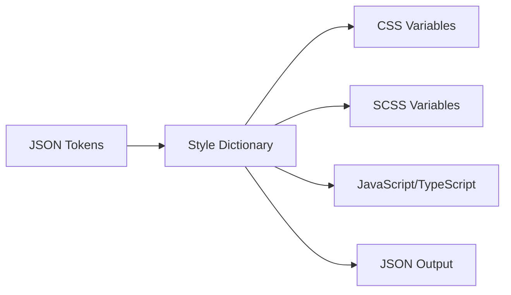
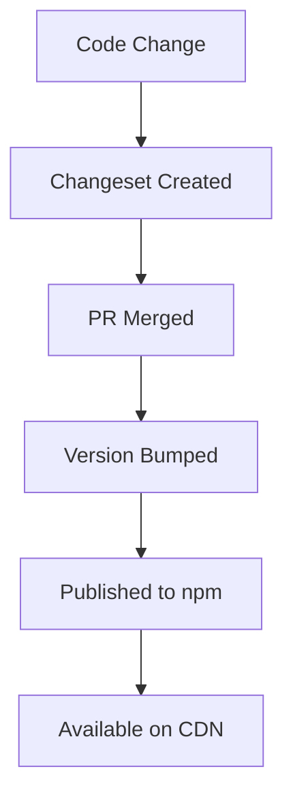

AtomChat Design System is built as a **monorepo** using modern tooling to manage multiple packages that work together seamlessly.

## Monorepo Structure

```
atomchat-ds/
├── packages/
│   ├── tokens/          → @atomchat.io/tokens
│   ├── css/             → @atomchat.io/css
│   ├── animations/      → @atomchat.io/animations
│   └── components-astro/ → @atomchat.io/components-astro
├── apps/
│   └── docs/            → Documentation site
├── scripts/             → Build and release scripts
└── .changeset/          → Version management
```

## Technology Stack

### Monorepo Management

| Tool | Purpose |
|------|---------|
| **pnpm** | Fast, disk-efficient package manager |
| **Turborepo** | High-performance build system |
| **Workspaces** | Package linking and dependency management |

### Token Pipeline

| Tool | Purpose |
|------|---------|
| **Style Dictionary v4** | Token transformation and compilation |
| **W3C DTCG Format** | Token specification standard |
| **LightningCSS** | CSS optimization and minification |

### Animation System

| Tool | Purpose |
|------|---------|
| **GSAP 3.12** | Animation engine |
| **ScrollTrigger** | Scroll-based animations |
| **Motion Detection** | Accessibility-first motion control |

### Release Management

| Tool | Purpose |
|------|---------|
| **Changesets** | Semantic versioning automation |
| **GitHub Actions** | CI/CD pipeline |
| **npm** | Package registry |

## Design Principles

### 1. Token-First Approach

Every visual design decision is encoded as a design token. No hardcoded values are allowed in component styles.

```css
/* ✅ Token-based */
.button {
  background: var(--bg-primary);
  padding: var(--gap-m);
}

/* ❌ Hardcoded */
.button {
  background: #3b82f6;
  padding: 1rem;
}
```

### 2. Three-Layer Architecture

Tokens are organized in a hierarchical structure:

1. **Primitive** → Raw foundation values
2. **Semantic** → Intent-driven tokens
3. **Component** → Component-specific overrides

[Learn more about Token Layers →](/architecture/token-layers/)

### 3. Independent Versioning

Each package can be versioned and published independently:

- `@atomchat.io/tokens` can be on v2.0.0
- `@atomchat.io/css` can be on v1.5.0
- `@atomchat.io/animations` can be on v1.2.0

### 4. Accessibility First

All features respect user preferences:

- **prefers-reduced-motion**: Animations disabled or simplified
- **prefers-color-scheme**: Automatic theme detection
- **WCAG Compliance**: Color contrast and interactive states

### 5. Framework Agnostic

Tokens work with any web framework:

- React / Next.js
- Vue / Nuxt
- Astro
- Svelte / SvelteKit
- Vanilla HTML/CSS

## Build Process

### Token Compilation



1. Design tokens defined in JSON (W3C DTCG format)
2. Style Dictionary transforms tokens
3. Multiple output formats generated
4. Published to npm and available via CDN

### Release Workflow



## Package Dependencies

```mermaid
graph TD
    A[@atomchat.io/tokens] --> B[@atomchat.io/css]
    A --> C[@atomchat.io/components-astro]
    D[@atomchat.io/animations] --> C
    E[GSAP] --> D
```

- **tokens** is the foundation for everything
- **css** depends on tokens
- **components** depend on tokens and animations
- **animations** requires GSAP as a peer dependency

## CDN Distribution

All packages are automatically published to jsDelivr CDN:

```
https://cdn.jsdelivr.net/npm/@atomchat.io/{package}@{version}/{path}
```

**Example:**
```
https://cdn.jsdelivr.net/npm/@atomchat.io/tokens@1.0.0/build/css/tokens.css
```

## Development Workflow

### Local Development

```bash
# Clone repository
git clone https://github.com/karenrebecag/ATOM_DS.git
cd atomchat-ds

# Install dependencies
pnpm install

# Build all packages
pnpm build

# Watch mode for development
pnpm dev
```

### Adding Changes

```bash
# Make your changes

# Create a changeset
pnpm changeset

# Commit changes
git add .
git commit -m "feat(tokens): add new spacing scale"
```

### Publishing

```bash
# Version packages (updates package.json versions)
pnpm changeset version

# Build all packages
pnpm build

# Publish to npm
pnpm changeset publish
```

## Package Overview

### @atomchat.io/tokens

**Purpose:** Design token source of truth

**Output Formats:**
- CSS custom properties
- SCSS variables
- JavaScript (ESM/CJS)
- TypeScript definitions
- Raw JSON

**Version:** 1.0.0

[Learn more about Packages →](/architecture/packages/)

### @atomchat.io/css

**Purpose:** Pre-compiled CSS bundle

**Includes:**
- All design tokens
- Modern CSS reset
- Base utilities
- Component styles

### @atomchat.io/animations

**Purpose:** GSAP animation system

**Features:**
- ScrollTrigger effects
- Page transitions
- Micro-interactions
- Motion preference detection

## Best Practices

1. **Always use tokens**: Never hardcode visual values
2. **Start with semantic layer**: Use semantic tokens before component tokens
3. **Respect user preferences**: Check for reduced motion, color scheme
4. **Version carefully**: Follow semantic versioning
5. **Test across frameworks**: Ensure tokens work in all environments

## Next Steps

- [Packages](/architecture/packages/) - Deep dive into each package
- [Token Layers](/architecture/token-layers/) - Understanding the three-layer system
- [Design Tokens](/foundations/tokens/) - Explore available tokens
